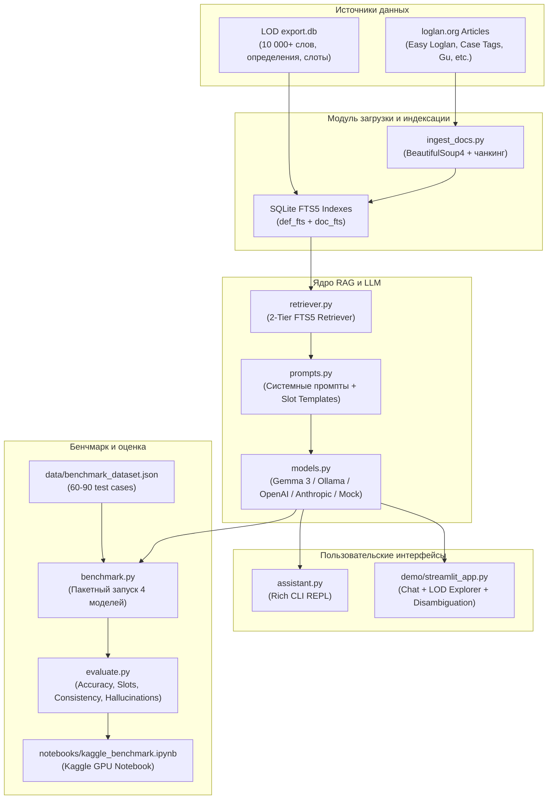

# План действий: Loglan Bench

> **Проект**: Loglan Bench — AI-ассистент по грамматике Loglan на Gemma + LLM-бенчмарк (формальный язык с нулевой неоднозначностью vs естественные языки).  
> **Автор**: [@torrua](https://github.com/torrua) (maintainer [LOD Manager](https://github.com/torrua/LOD_manager))  
> **Дата старта**: 2 октября 2026 г.  
> **Целевые дедлайны**:
> 1. **Hacktoberfest Weekend Challenge** («Build for a Friend»): **5 октября 2026, 06:59 UTC (09:59 MSK)**
> 2. **Kaggle Benchmarking Challenge**: **11 октября 2026, 23:59 PDT**

---

## 1. Обзор проекта и стратегические цели

### 1.1. Суть проблемы
Логлан (Loglan) — язык с **нулевой синтаксической неоднозначностью**, созданный в 1955 году на базе логики предикатов первого порядка. Каждое грамматически верное высказывание имеет строго одно синтаксическое дерево. 

Однако в сообществе Loglan:
- Объяснение грамматики новичкам и поиск аргументных слотов предикатов вручную отнимает часы.
- Словарь LOD (10 000+ слов) содержит предикатные слоты и ключевые слова, но грамматические статьи и учебные материалы разбросаны по сайту `loglan.org`.
- Языковые модели (LLM) часто путают синтаксические модификаторы в естественных языках (классический пример: *«Pretty little girls' school»* имеет более 5 вариантов разбора в английском, но ровно 1 вариант для каждой конкретной конструкции в Loglan).

### 1.2. Продукты разработки
1. **Loglan Grammar Assistant (CLI + Web UI)**:
   - Двухуровневый RAG-пайплайн: словарь LOD (SQLite) + статьи и учебники с `loglan.org` через полнотекстовый поиск FTS5.
   - LLM: **Gemma 3** (open-weight модель от Google через `google-genai` SDK или локально через Ollama).
   - Вывод: ответы с точными цитатами словарных статей, разбором аргументных слотов ($x_1, x_2, \dots$) и синтаксических деревьев.
2. **LLM Formal Language Benchmark**:
   - Датасет из 60–90 задач по 3 категориям (Disambiguation, Predicate Slot Identification, Translation Consistency).
   - Сравнение 4 моделей: Gemma 3, Llama 3.1 8B, GPT-4o-mini, Claude 3.5 Haiku.
   - Kaggle Notebook + датасет + визуализация метрик.
3. **Две статьи на DEV.to**:
   - Статья A: Hacktoberfest Weekend Challenge («My Friend Can't Explain Loglan Grammar Fast Enough...»).
   - Статья B: Kaggle Benchmarking Challenge (строго по шаблону «What I Benchmarked»).

---

## 2. Архитектура системы



---

## 3. Структура репозитория

```
loglan_bench/
├── .env.example              # Шаблон переменных окружения (GEMINI_API_KEY, OLLAMA_HOST)
├── .gitignore                # Исключения git (.env, __pycache__, results/raw, *.db.bak)
├── LICENSE                   # Лицензия MIT
├── README.md                 # Полное описание проекта, установка, запуск
├── requirements.txt          # Python-зависимости
├── ACTION_PLAN.md            # Данный план действий
├── data/
│   ├── export.db             # LOD SQLite база данных + таблицы documents, doc_fts, def_fts
│   └── benchmark_dataset.json# Золотой датасет для бенчмарка (60-90 примеров)
├── src/
│   ├── __init__.py
│   ├── config.py             # Настройки проекта, пути, конфигурации моделей
│   ├── ingest_docs.py        # Скрейпер статей loglan.org, чанкинг, построение FTS5
│   ├── retriever.py          # Двухуровневый RAG (LOD definitions + doc_fts)
│   ├── prompts.py            # Промпты для ассистента, парсинга и слотов
│   ├── models.py             # Единый интерфейс к LLM (Google GenAI, Ollama, OpenAI, Anthropic, Mock)
│   ├── assistant.py          # CLI-ассистент на Rich с интерактивным режимом
│   ├── benchmark.py          # Запуск бенчмарка по датасету
│   └── evaluate.py           # Расчёт метрик, генерация summary.csv и графиков
├── notebooks/
│   └── kaggle_benchmark.ipynb# Kaggle Notebook для Challenge B
├── demo/
│   └── streamlit_app.py      # Streamlit веб-демо (ассистент, словарь, визуализатор)
├── results/
│   ├── raw/                  # Сырые ответы моделей в формате JSON
│   ├── summary.csv           # Итоговые метрики
│   └── charts/               # Графики в формате PNG для статей
└── articles/
    ├── hacktoberfest_build_for_a_friend.md # Статья для Hacktoberfest Weekend Challenge
    └── kaggle_benchmarking_challenge.md   # Статья для Kaggle Benchmarking Challenge
```

---

## 4. Этапы и пошаговый график выполнения

### Фаза 1: Фундамент и Инфраструктура (2 октября)

- [ ] **Шаг 1.1. Базовые файлы проекта**:
  - Создать `requirements.txt`, `.gitignore`, `.env.example`, `LICENSE` (MIT).
  - Инициализировать Git-репозиторий и зафиксировать структуру.
- [ ] **Шаг 1.2. База данных корпуса LOD**:
  - Скопировать проверенную базу `loglan_export.db` из `../loglan_convert/data/` в `data/export.db`.
  - Проверить наличие таблиц: `words`, `definitions`, `keys`, `connect_words`, `types`.
- [ ] **Шаг 1.3. Скрейпинг и индексация грамматических документов (`ingest_docs.py`)**:
  - Написать парсер статей с `https://www.loglan.org/Articles/`:
    * `easy-loglan-introduction.html` (11 уроков)
    * `easy-loglan-description.html`
    * `case-tag-theory.html`
    * `complex-making.html`
    * `faces-of-gu.html`
    * `sets-and-masses.html`, `sets-and-multiples.html`
    * `logic-and-economy.html`
  - Создать таблицу `documents (id, title, source_url, chunk, chunk_index)`.
  - Построить виртуальную таблицу полнотекстового поиска FTS5: `doc_fts`.
  - Построить виртуальную таблицу полнотекстового поиска FTS5 по словарю: `def_fts` (`definitions.body`, `usage`, `notes`).
  - Выполнить проверку поиска по ключевым словам (`donsu`, `ge`, `modifier`, `clause`).
- [ ] **Шаг 1.4. Модуль конфигурации (`config.py`)**:
  - Реализовать класс настроек с поддержкой чтения из `.env` и переменных окружения:
    * `GEMINI_API_KEY`, `OLLAMA_BASE_URL`, `DB_PATH`, `DEFAULT_MODEL`.
- [ ] **Шаг 1.5. Двухуровневый ретривер (`retriever.py`)**:
  - Уровень 1: Поиск по словарю (слова, предикатные слоты $x_1, \dots, x_n$, тип слова, аффиксы, примеры использования).
  - Уровень 2: Поиск по грамматическим статьям (правила связывания, логические операторы, частицы).
  - Фоллбек на `LIKE` поиск при отсутствии точных совпадений FTS5.
  - Форматирование контекста для промпта с цитированием источников.

---

### Фаза 2: Gemma Assistant и Интерфейсы (2–3 октября)

- [ ] **Шаг 2.1. Промпт-инжиниринг (`prompts.py`)**:
  - `SYSTEM_PROMPT`: строгие правила ответа на базе предоставленного контекста, запрет галлюцинаций, формат цитирования.
  - Шаблоны для:
    1. Перевода и разъяснения синтаксического дерева.
    2. Расшифровки аргументных слотов предиката.
    3. Сравнения неоднозначности: English vs Loglan.
- [ ] **Шаг 2.2. Универсальный адаптер моделей (`models.py`)**:
  - `GoogleGenAIProvider`: интеграция с новым SDK `google-genai` (поддержка `gemma-3-27b-it`, `gemma-3-12b-it`, `gemini-2.5-flash`).
  - `OllamaProvider`: поддержка локального запуска Gemma 3 / Llama 3.1 без облачных API.
  - `OpenAIProvider` и `AnthropicProvider`: адаптеры для сравнительного бенчмарка.
  - `MockProvider`: детерминированный генератор ответов для юнит-тестов и автономной работы без ключей.
- [ ] **Шаг 2.3. Консольный ассистент (`assistant.py`)**:
  - Реализация интерфейса на базе библиотеки `rich`:
    * Режим одиночного запроса: `python src/assistant.py --query "..."`
    * Интерактивный REPL-режим: `python src/assistant.py --interactive`
    * Встроенные команды: `/slots <word>`, `/word <word>`, `/compare <english>`, `/help`.
    * Выделение цитат из словаря и уроков грамматики цветом.
- [ ] **Шаг 2.4. Веб-интерфейс (`demo/streamlit_app.py`)**:
  - Вкладка 1: Интерактивный чат с ассистентом (с раскрывающимся блоком `RAG Context Inspector`).
  - Вкладка 2: Эксплорер словаря LOD с мгновенным поиском по 10 000+ словам и фильтром по частям речи/типам.
  - Вкладка 3: Визуализатор неоднозначности (наглядное сопоставление 5 разборов английской фразы и 1 разбора Loglan).

---

### Фаза 3: Разработка Бенчмарка и Эксперименты (3–4 октября)

- [ ] **Шаг 3.1. Создание золотого датасета (`data/benchmark_dataset.json`)**:
  - **Категория A: Disambiguation (25 задач)**:
    * Примеры: *"Pretty little girls' school"*, *"I saw the man with the telescope"*, *"Flying planes can be dangerous"*, *"The chicken is ready to eat"*, *"We need more intelligent leaders"*, *"Visiting relatives can be boring"*, и др.
    * Поля: `english`, `loglan_phrases`, `expected_english_parses`, `expected_loglan_parses`, `gold_explanation`.
  - **Категория B: Predicate Slot Identification (25 задач)**:
    * Предикаты с 1–5 слотами (`donsu`, `proga`, `vedma`, `tsani`, `kanzo`, `blanu`, `ditca`, и др.).
    * Проверка извлечения ролей: кто субъект, объект, адресат, инструмент, условие.
  - **Категория C: Translation Consistency (25 задач)**:
    * 5 повторных запусков на задачу при $T=0.2$ и $T=0.7$.
    * Оценка стабильности и семантической эквивалентности.
- [ ] **Шаг 3.2. Раннер бенчмарка (`benchmark.py`)**:
  - Пакетное тестирование с логированием задержек (latency), потребления токенов и сырых ответов в `results/raw/`.
  - Поддержка возобновления при сбоях (checkpoints).
- [ ] **Шаг 3.3. Модуль оценки метрик (`evaluate.py`)**:
  - Расчёт метрик:
    * **Parse Count Accuracy**: точное совпадение количества найденных вариантов разбора.
    * **Slot Accuracy**: % правильно идентифицированных слотов $x_1 \dots x_n$.
    * **Consistency Score**: парное сходство ответов при 5 прогонах.
    * **Hallucination Rate**: автоматическая верификация выдуманных слов против `export.db`.
  - Построение графиков через `matplotlib` и `seaborn` в директорию `results/charts/`:
    * Сравнение точности моделей (Bar chart).
    * Распределение ошибок по категориям (Heatmap).
    * Радарная диаграмма (Radar plot): Accuracy vs Consistency vs Speed vs Hallucination-free.
- [ ] **Шаг 3.4. Kaggle Notebook (`notebooks/kaggle_benchmark.ipynb`)**:
  - Автономный блокнот: загрузка LOD и датасета, инференс Gemma 3 на Kaggle GPU T4/P100, воспроизведение вычислений и графиков.

---

### Фаза 4: Подготовка Статей и Релизы (4–5 октября)

- [ ] **Шаг 4.1. Статья для Hacktoberfest Weekend Challenge (Дедлайн: 5 октября 06:59 UTC)**:
  - Файл: `articles/hacktoberfest_build_for_a_friend.md`
  - Заголовок: *"My Friend Can't Explain Loglan Grammar Fast Enough — So I Built Him an AI That Speaks a 1950s Artificial Language"*
  - Теги: `#hf26challenge`, `#hacktoberfest`, `#ai`, `#opensource`
  - Полное раскрытие критериев судейства:
    * **Writing Quality**: увлекательная лингвистическая и инженерная история.
    * **Relevance to Theme**: история «для друга» (помощь ментору сообщества Loglan).
    * **Open-Source AI at core**: акцент на Gemma, локальный запуск, конфиденциальность словаря.
    * **Technical Execution**: скриншоты CLI, архитектура RAG, ссылки на код и демо.
- [ ] **Шаг 4.2. Статья для Kaggle Benchmarking Challenge (Дедлайн: 11 октября 23:59 PDT)**:
  - Файл: `articles/kaggle_benchmarking_challenge.md`
  - Строгое следование обязательному шаблону:
    * `## What I Benchmarked`
    * `## Models Tested`
    * `## Findings & Real-World Meaning`
    * `## Where can we see it?` (ссылки на Kaggle Notebook, Dataset, GitHub).
- [ ] **Шаг 4.3. Финальный README.md и верификация репозитория**:
  - Документация, бейджи, примеры вызовов, инструкция по установке в 1 команду.

---

## 5. План верификации и приёмочные тесты

| Компонент | Метод проверки | Ожидаемый результат |
|---|---|---|
| **База данных** | `SELECT count(*) FROM words` | > 10 000 словарных записей |
| **Скрейпинг документов** | `python src/ingest_docs.py` | Загружено $\ge 8$ статей, созданы `documents` и `doc_fts` |
| **FTS5 Поиск** | Запрос к `retriever.py` по слову `donsu` | Возвращены словарные слоты + выдержка из грамматики |
| **CLI Ассистент** | `python src/assistant.py --query "What is donsu?" --mock` | Вывод с цветным форматированием и цитатой |
| **Бенчмарк** | `python src/benchmark.py --test-run --limit 3` | Успешное сохранение `results/raw/mock_results.json` |
| **Оценка метрик** | `python src/evaluate.py --results-file results/raw/mock_results.json` | Генерация `summary.csv` и графиков PNG в `results/charts/` |
| **Streamlit Demo** | `streamlit run demo/streamlit_app.py` | Веб-интерфейс открывается, все 4 вкладки работоспособны |
| **Статьи** | Валидация по чеклистам DEV.to | Соответствие структуре и тегам обоих челленджей |

---

## 6. Чеклист готовности к сабмишну

### Hacktoberfest Weekend Challenge (до 5 октября 09:59 MSK)
- [ ] Репозиторий на GitHub открыт под лицензией MIT.
- [ ] Работает CLI и Streamlit-демо.
- [ ] Статья опубликована на DEV с тегами `#hf26challenge #hacktoberfest #ai #opensource`.
- [ ] В статье прикреплена ссылка на репозиторий и демонстрацию (видео / скриншоты / ссылка).
- [ ] Сабмит отправлен на странице челленджа: https://dev.to/challenges/hacktoberfest-weekend-2026-10-01.

### Kaggle Benchmarking Challenge (до 11 октября 23:59 PDT)
- [ ] Kaggle Notebook опубликован в открытом доступе со статусом Public.
- [ ] Kaggle Dataset с `benchmark_dataset.json` опубликован.
- [ ] Статья опубликована на DEV по обязательному шаблону с тегами `#kagglechallenge #devchallenge #ai #machinelearning`.
- [ ] Сабмит отправлен на странице челленджа: https://dev.to/challenges/kaggle-2026-09-23.
